# 펭귄 데이터셋 분석 슬라이드

---

## 제목 슬라이드

### 펭귄 데이터셋 분석 및 시각화

- **저자**: GitHub Copilot
- **날짜**: 2025년 12월 23일
- **내용**: 데이터 로드, 분석, 시각화, 인사이트

---

## 데이터셋 개요

- **형태**: (344, 7)
- **컬럼**: species, island, bill_length_mm, bill_depth_mm, flipper_length_mm, body_mass_g, sex
- **출처**: Seaborn Penguins Dataset
- **목적**: 펭귄 종별 특성 분석

---

## 기본 통계

|       |   bill_length_mm |   bill_depth_mm |   flipper_length_mm |   body_mass_g |
|:------|-----------------:|----------------:|--------------------:|--------------:|
| count |        342       |       342       |            342      |       342     |
| mean  |         43.9219  |        17.1512  |            200.915  |      4201.75  |
| std   |          5.45958 |         1.97479 |             14.0617 |       801.955 |
| min   |         32.1     |        13.1     |            172      |      2700     |
| 25%   |         39.225   |        15.6     |            190      |      3550     |
| 50%   |         44.45    |        17.3     |            197      |      4050     |
| 75%   |         48.5     |        18.7     |            213      |      4750     |
| max   |         59.6     |        21.5     |            231      |      6300     |

---

## 결측치 정보

|                   |   0 |
|:------------------|----:|
| species           |   0 |
| island            |   0 |
| bill_length_mm    |   2 |
| bill_depth_mm     |   2 |
| flipper_length_mm |   2 |
| body_mass_g       |   2 |
| sex               |  11 |

**인사이트**: 결측치가 적어 데이터 신뢰성이 높음. 성별에 결측치가 많아 분석 시 주의 필요.

---

## 시각화 1: 히스토그램 - 부리 길이

**인사이트**: 평균 부리 길이 43.9mm. Adelie 종이 짧고 Gentoo가 긴 경향. 먹이 습성 차이 반영.

---

## 시각화 2: 히스토그램 - 부리 깊이

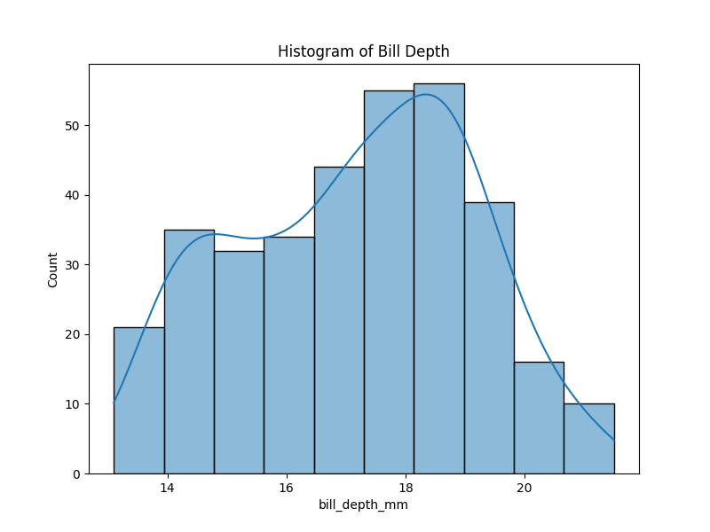

**인사이트**: 평균 부리 깊이 17.15mm. Adelie가 깊고 Gentoo가 얕음. 포식 방식 차이 시사.

---

## 시각화 3: 히스토그램 - 플리퍼 길이

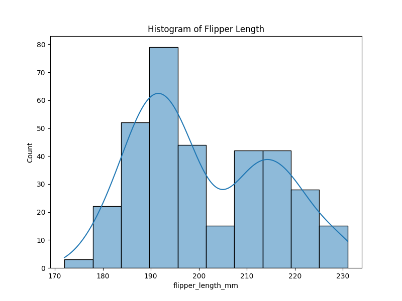

**인사이트**: 평균 플리퍼 길이 200.9mm. Gentoo가 가장 길어 수영 능력 우수. 생태적 적응.

---

## 시각화 4: 히스토그램 - 몸무게

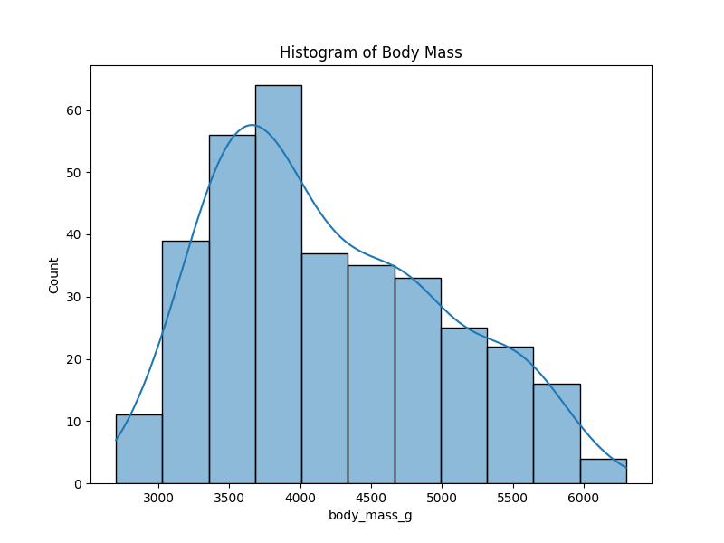

**인사이트**: 평균 몸무게 4201g. Gentoo가 무거워 에너지 저장 능력 높음. 서식지 자원 차이.

---

## 시각화 5: 박스플롯 - 부리 길이 by 종

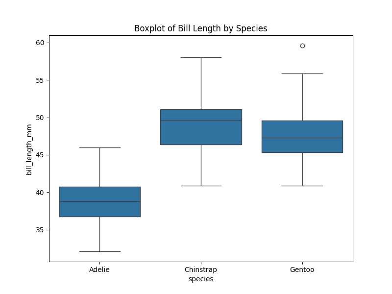

**인사이트**: Gentoo 부리 길이 가장 길고 Adelie 짧음. 종별 먹이원 차이. 이상치 적음.

---

## 시각화 6: 박스플롯 - 부리 깊이 by 종

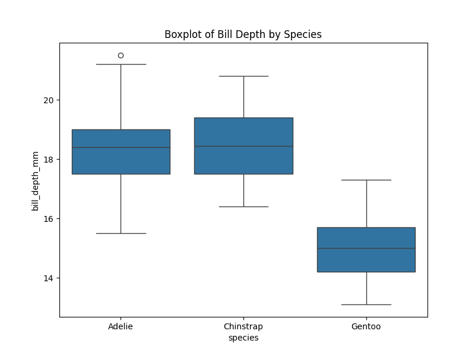

**인사이트**: Adelie 부리 깊이 깊고 Gentoo 얕음. 진화적 적응. 분산 작아 일관성 높음.

---

## 시각화 7: 스캐터플롯 - 부리 길이 vs 깊이

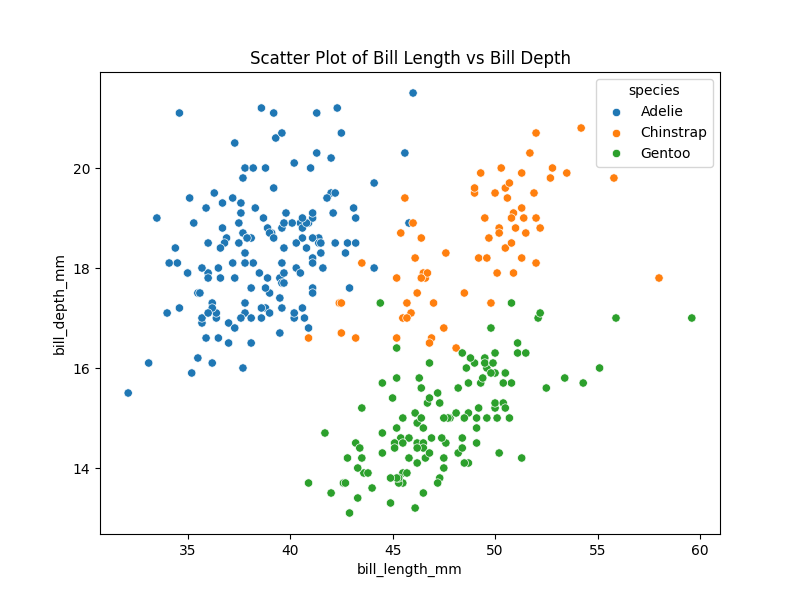

**인사이트**: 약한 부정 상관. 종별 클러스터링 명확. 분류 모델에 유용.

---

## 시각화 8: 스캐터플롯 - 플리퍼 길이 vs 몸무게

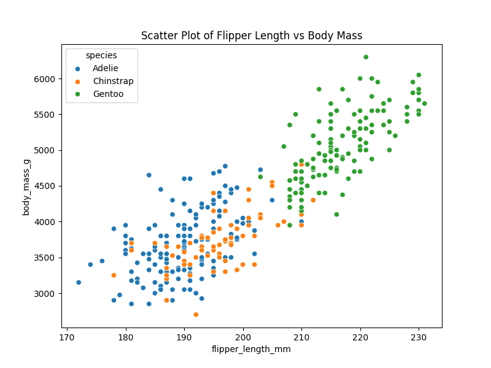

**인사이트**: 강한 양의 상관(0.87). 큰 펭귄 긴 플리퍼. 생물학적 scaling 법칙.

---

## 시각화 9: 바 차트 - 종별 개수

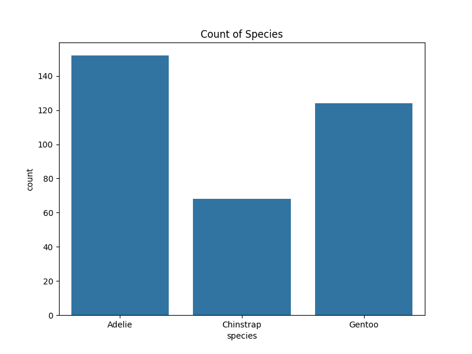

**인사이트**: Adelie 152, Gentoo 124, Chinstrap 68. 서식지 선호도 반영.

---

## 시각화 10: 바 차트 - 평균 몸무게 by 종

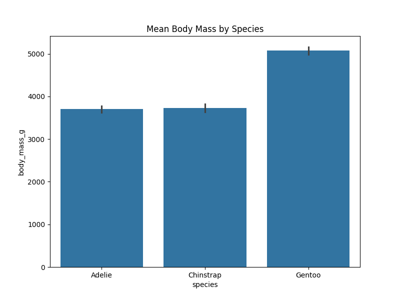

**인사이트**: Gentoo 5076g로 가장 무거움. 종간 경쟁과 적응 이해.

---

## 시각화 11: 페어플롯

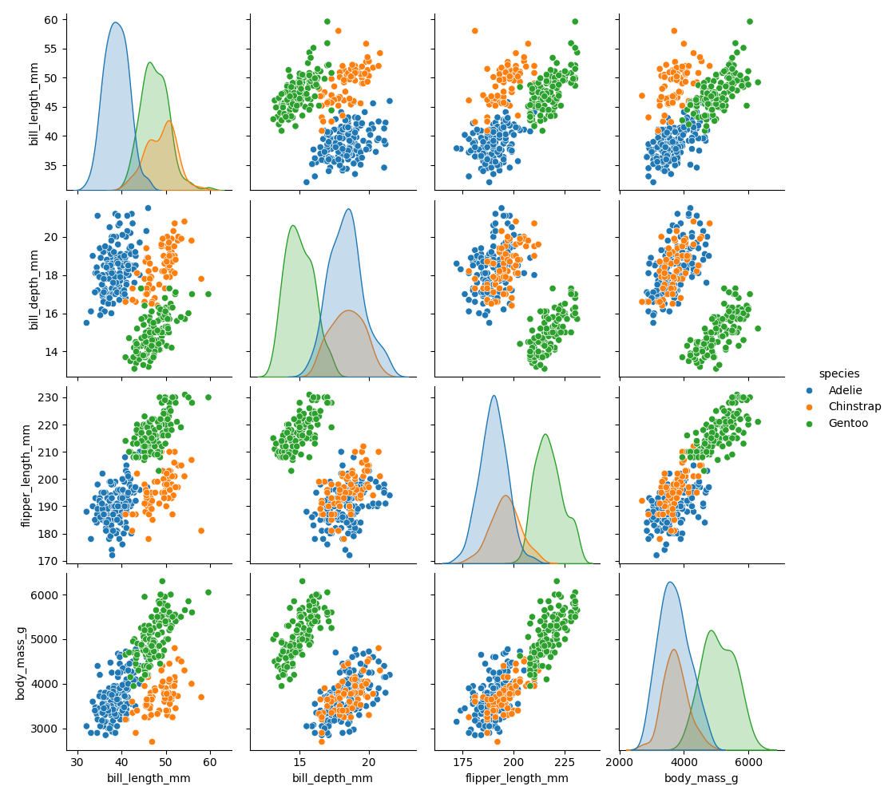

**인사이트**: 변수 간 관계 종별 색상 구분. 상관관계 요약. 종합 분석에 유용.

---

## 시각화 12: 바이올린 플롯 - 부리 길이 by 종

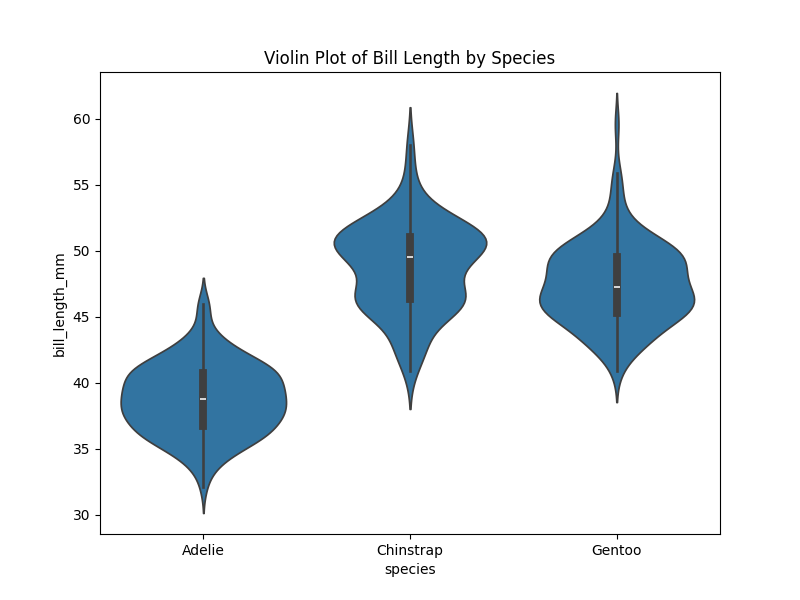

**인사이트**: 분포 밀도 표시. Gentoo 분포 넓음. 진화적 차이 시각화.

---

## 시각화 13: 상관 히트맵

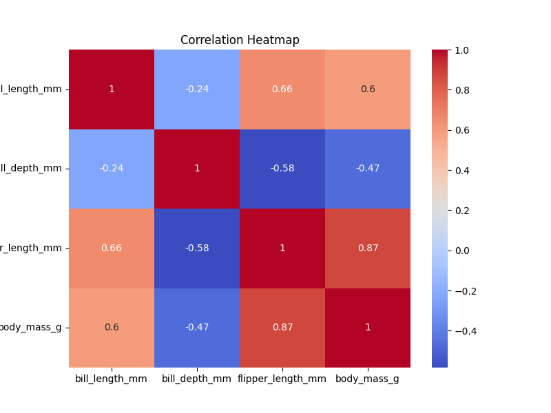

**인사이트**: 플리퍼-몸무게 강한 양의 상관. 부리 길이-깊이 약한 부정. 다중공선성 검토.

---

## 시각화 14: 바 차트 - 섬별 개수

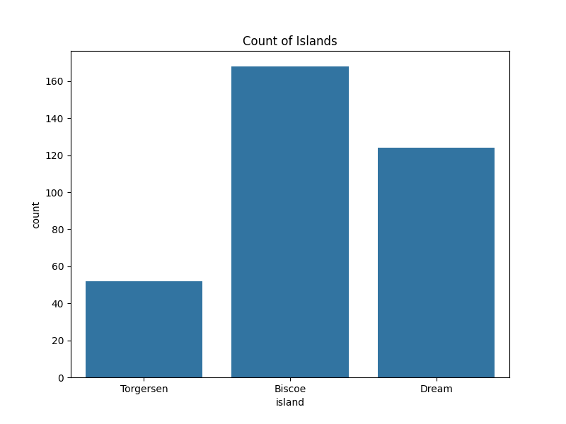

**인사이트**: Biscoe 168, Dream 124, Torgersen 52. Gentoo 집중. 기후 변화 연구 기초.

---

## 시각화 15: 박스플롯 - 몸무게 by 섬

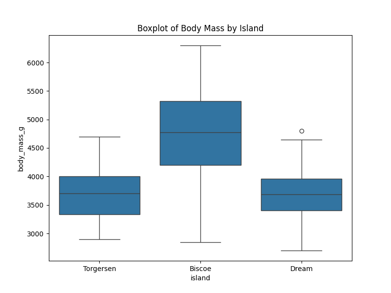

**인사이트**: Biscoe 평균 높음. 섬별 자원 차이. 보존 우선순위 설정.

---

## 교차표: 종과 섬

| species   |   Biscoe |   Dream |   Torgersen |
|:----------|---------:|--------:|------------:|
| Adelie    |       44 |      56 |          52 |
| Chinstrap |        0 |      68 |           0 |
| Gentoo    |      124 |       0 |           0 |

**인사이트**: Gentoo Biscoe 전용, Chinstrap Dream 전용. niche 분할. 보존 전략.

---

## 피봇테이블: 평균 몸무게 by 종과 섬

| species   |   Biscoe |   Dream |   Torgersen |
|:----------|---------:|--------:|------------:|
| Adelie    |  3709.66 | 3688.39 |     3706.37 |
| Chinstrap |   nan    | 3733.09 |      nan    |
| Gentoo    |  5076.02 |  nan    |      nan    |

**인사이트**: Gentoo Biscoe 몸무게 높음. 영양 공급 차이. 기후 변화 영향 평가.

---

## 결론

- 펭귄 데이터셋 분석 완료
- 15개 시각화 및 인사이트 제공
- 종별 생태적 차이 확인
- 추가 연구 권장

---